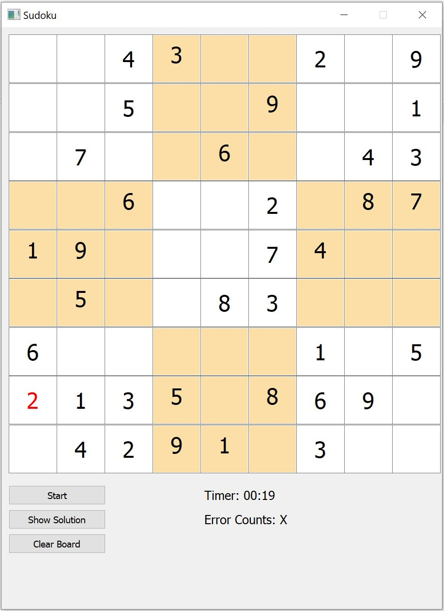

<!-- PROJECT LOGO -->
<h2 align="center">Sudoku-Game-and-Solver</h2>

<!-- ABOUT THE PROJECT -->
## About The Project

###Goals:
* Solve Sudoku puzzles using Recursive Backtracking algorithm
* build a GUI for game play

###MVC Pattern:
* Model: Sudoku solver built in Python using Recursive Backtracking algorithm
* View: GUI built with PyQt5 for game play
* Controller: also built with PyQt5 to connect model to view

  

The game has a sudoku grid, a timer and an error counter. The user are allowed up to three errors.

The empty sudoku puzzles are in "sudoku.csv", downloaded from the Kaggle page of Kyuyong Park at https://www.kaggle.com/bryanpark/sudoku.
## Built With
Python 3.7, PyQt5 module, Pandas module, and other basic Python modules.

## License
You may download/use/distribute/modify the code however you like.
